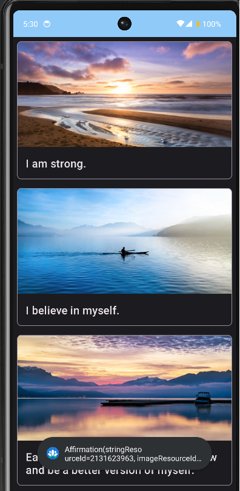

<h1 align="center">Affirmations list app📃✏️</a> 
<h3 align="center"> This is  my Affirmation list app fo Android in which user could whrite affirmations for himself and view the result to inspire</h3>
<h1 align="center"></a>
<h4 align="center"> This app with a minimum API level of 19 ✔️</h1>
<h1 align="center"></a>
<h4 align="center"> Screenshots of the Application below ⬇️ </h4>
<h4 align="center"></h4> 
<h4 align="center"></h4>
